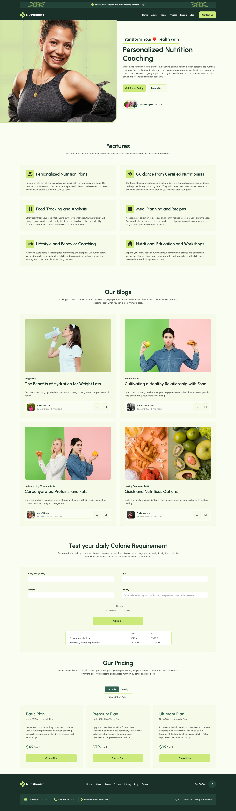
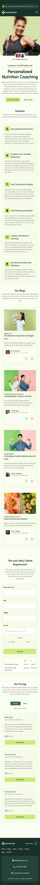

# Project the Health App mit Kcal Rechner

## Überblick

**Project the Health App mit Kcal Rechner** ist eine Webseite, die im Rahmen des Abschlussprojekts des **Modul 1** des Frontend-Entwicklungs-Bootcamps erstellt wurde. Dieses Projekt nutzt **HTML** und **CSS** zur Gestaltung und Strukturierung der Seite sowie **JavaScript** zur Implementierung eines Kalorienrechners.

[Hier kannst du die Live-Demo ansehen](https://manonsfoto.github.io/Project_Health_App-Modul1_Abschlussprojekt-/)

Das Projekt dauerte insgesamt etwa **18 Stunden**.

## Funktionen

- **Kalorienrechner (Kcal-Rechner):** Eine JavaScript-basierte Funktion, die es Nutzern ermöglicht, ihre tägliche Kalorienzufuhr anhand ihrer persönlichen Daten zu berechnen.
- **Responsives Design:** Die Seite passt sich verschiedenen Bildschirmgrößen an und bietet sowohl auf mobilen Geräten als auch auf Desktops eine optimale Darstellung.

## Technologien

- **HTML5:** Struktur der Webseite.
- **CSS3:** Layout und Gestaltung, inklusive responsivem Design mit Flexbox und Grid.
- **JavaScript:** Zur Berechnung der Kalorienzufuhr auf Basis von Nutzereingaben.

## Reflektion

1. Keep: Was hat gut funktioniert und sollte beibehalten werden?

- **Aktive Nutzung der DevTools:** Die Nutzung von DevTools während der Entwicklung hat mir viel Zeit gespart und hat mir geholfen, Fehler schnell zu identifizieren und zu beheben.
- **Ruhe bewahren:** Bei Problemen oder Hürden habe ich versucht, ruhig zu bleiben und die Ursache Schritt für Schritt zu finden.
- **Kombination von Grid und Flexbox:** Die Mischung dieser beiden Layout-Techniken hat sich als sehr effizient erwiesen und das responsive Design deutlich vereinfacht.

2. Start: Was könnte ich in Zukunft verbessern oder neu anfangen?

- **Vertiefung in JavaScript:** Die Arbeit mit JavaScript hat mir Freude bereitet, und ich möchte meine Fähigkeiten weiter ausbauen, um komplexere Funktionen für Webseiten zu entwickeln.

3. Stop: Welche Maßnahmen sollten ergriffen werden, um zukünftige Probleme zu vermeiden?

- **Frühe Berücksichtigung von responsive Design:** Zu Beginn habe ich nicht genug auf das responsive Design geachtet und einige Elemente mit fester Breite versehen, was später zu Anpassungsproblemen führte.
- **Vermeidung von tief verschachtelten Divs:** Ich habe zu viele Div-Elemente verschachtelt, was den Code für andere Personen schwer lesbar machen würde. Nächstes Mal möchte ich mehr semantic HTML-Tags und bessere Klassennamen verwenden, um den Code strukturierter und zugänglicher zu machen.

## Projektvorschau

